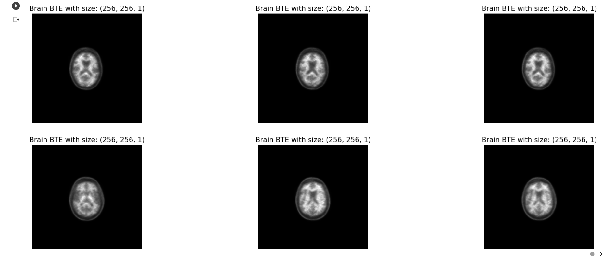
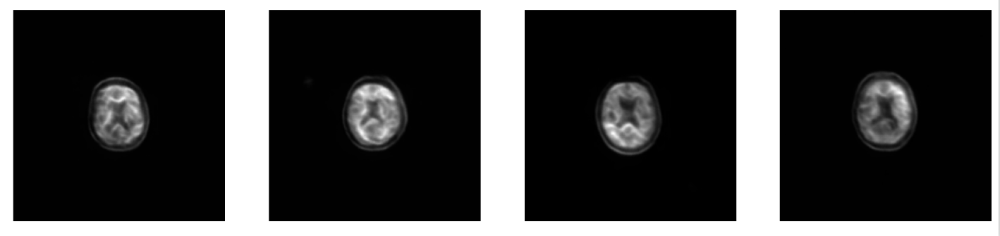
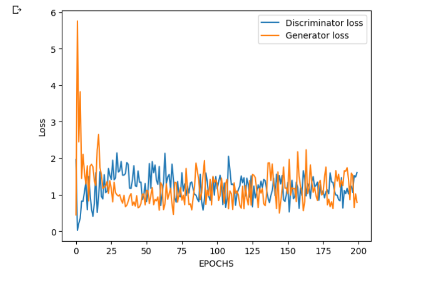

# Image-to-image-translation
Image-to-image translation For alzheimer's disease PTE scanner using DCGAN implementation 
----
### 📑Table of Contents
You're sections headers will be used to reference location of destination.

- 🟠[Features](#Features)
- 🔵[Dataset](#Dataset)
- 🟢[Tools](#Tools)
- 🔴[Notes](#Notes)

---

## 🟠Features

generate fake images: 

- generate fake images with accuracy (90%-95%)

---
🔶-Sample Of Real Images :-
---

---
🔶-Sample Of Fake Images :-
---

---
🔶-Loss For Generator and Discriminator :-
---

---
🔶-SSIM :-
---
.png)
.png)

---

## 🔵Dataset
----
About Dataset : 
- Dataset from Aibl 
- Dataset used in project ▶️ https://drive.google.com/drive/folders/1LR3F4bl0LPdsTdQikIR4bG4G3Hpte0kp?usp=sharing
- For More or Difirent Dataset Visit ▶️ https://ida.loni.usc.edu/login.jsp  
----

## 🟢Tools
----
- python
----

### 🔴Notes
----
- Note : Tuning file for model ▶️ https://github.com/Joseph-Essa/Image-to-image-translation-GAN/tree/6106d29625cfe2e61e387a8277e5ed11a12b1429/tuning__file
- Note : Used Dataset in this project has a bad quality because it a PET scanners you can use MRI scanners for better quality and results 
- Note : Check Code With outputs ▶️ https://github.com/Joseph-Essa/Image-to-image-translation-GAN/blob/0293e94deb20c3d7d7bad259e4d48eaf1692d17b/Image_to_image_translation_(GAN).ipynb
----
